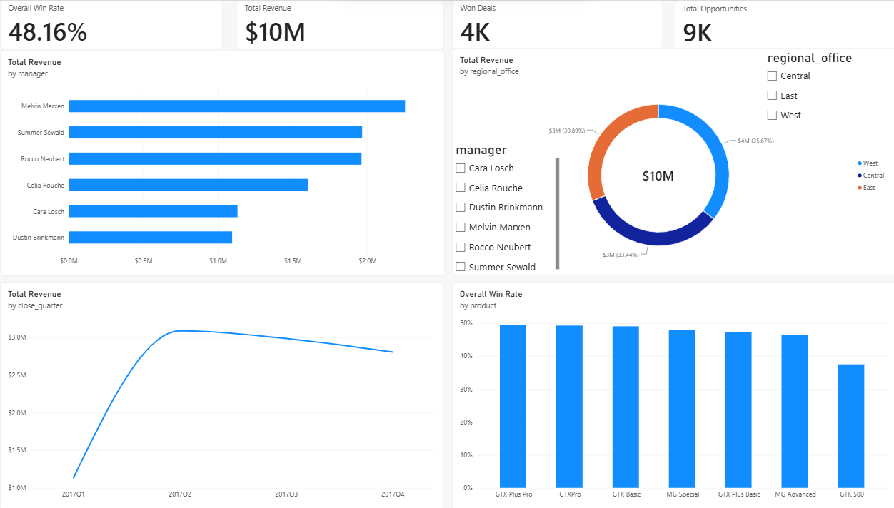

# CRM Sales Performance Dashboard

## Project Overview
This end-to-end CRM Sales Performance Analysis project transforms raw sales pipeline data into interactive visualizations using Power BI. It tracks $10M in total revenue across 9,000+ opportunities, providing key business insights into regional revenue distributions, sales manager performance, quarterly revenue momentum, and product conversion rates.

---

## Live Dashboard Preview


---

## Interactive Demonstration
<video src="dashboard_demo.mp4" controls width="100%"></video>

---

## Key Business Insights
* **Revenue & Win Rate:** Total revenue reached **$10M** across **9K total opportunities** and **4K won deals**, achieving an overall win rate of **48.16%**.
* **Regional Performance:** Revenue distribution is balanced across all regions, led by the **West (35.67%)**, followed by **Central (33.44%)**, and **East (30.89%)**.
* **Top Sales Managers:** **Melvin Marxen** is the top-performing sales manager, driving over **$2.2M** in closed revenue.
* **Quarterly Trajectory:** Revenue peaked in **2017 Q2 ($3.08M)** before stabilizing across Q3 and Q4.
* **Product Efficiency:** Product win rates remain consistent near the ~50% mark, led by high-performing offerings such as **GTX Plus Pro** and **GTXPro**.

---

## Data Model & DAX Measures
The key metrics were calculated using the following DAX expressions:

* **Total Revenue:**
  ```dax
  Total Revenue = SUM(cleaned_crm_sales_master[close_value])
